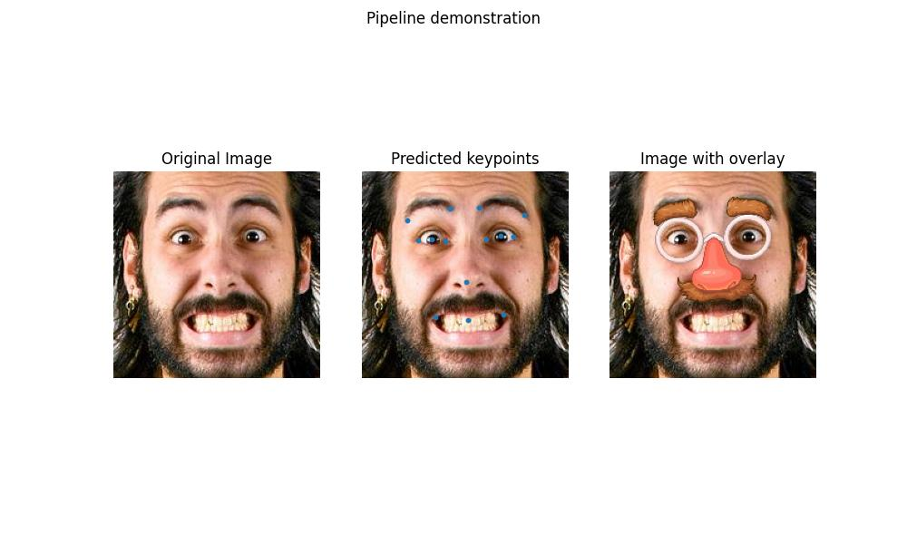

# face-keypoints-overlay

Deep learning pipeline for facial keypoint regression with a modular system for overlaying graphics on detected faces.

## Demo



---

## Features

- Facial keypoint regression (CNN / ResNet-like models)
- Modular training pipeline with early stopping and mixed precision (AMP)
- Flexible configuration system (CLI + YAML + ENV)
- Callback-based inference pipeline
- Keypoint-driven overlay system for applying graphical masks
- Albumentations-based augmentation pipeline
- Clean CLI interface for all stages (train / inference / overlay)

---

## Pipeline

The project is organized into three independent pipelines:

### Training
- Dataset loading and augmentation
- Model training with AMP
- Metric computation (MSE, MAE, NME)
- Early stopping and best model selection

### Inference
- Image preprocessing
- Keypoint prediction
- Optional visualization

### Overlay
- Keypoint-based transformations
- Mask application
- Result visualization

### Data flow

image → preprocessing → model → keypoints → overlay

---

## Installation

### macOS / Linux

```bash
git clone git@github.com:hyppocritt/face-keypoints-overlay.git
cd face-keypoints-overlay

python3 -m venv .venv
source .venv/bin/activate

python3 -m pip install -r requirements.txt
```

### Windows (Powerhell)

```bash
git clone git@github.com:hyppocritt/face-keypoints-overlay.git
cd face-keypoints-overlay

python -m venv .venv
.venv\Scripts\Activate.ps1

python -m pip install -r requirements.txt

```

---

## Usage

### Training

Run training:

```bash
python -m src train --data path/to/data
```

With overrides:

```bash
python -m src train \
    --data path/to/data \
    training.lr=0.01 \
    dataloader.batch_size=32
```

### Inference

Run inference:

```bash
python -m src inference --data path/to/data
```

With overrides:

```bash
python -m src inference \
    --data path/to/data \
    inference.vis=first \
    detect.use_amp=true
```

### Overlay

Run overlay pipeline:

```bash
python -m src overlay --data path/to/data
```

With overrides:

```bash
python -m src overlay \
    --data path/to/data \
    overlay.mask=default \
    overlay.save=true
```

---

## Configuration

The project uses a unified configuration system:
- CLI arguments
- YAML config files
- Environment variables
- Default values

Priority:
CLI > YAML > ENV > defaults

Example:

```bash
python -m src train --config path/to/config.yaml
```

CLI overrides always have higher priority than YAML configuration.

---

## Project structure

```
src/
  training.py
  inference.py
  overlay.py
  cli.py
  dataset.py
  models/
  utils/
```

---

## Metrics
- MSE (Mean Squared Error)
- MAE (Mean Absolute Error)
- NME (Normalized Mean Error)

---

## Future Improvements
- Face detection integration for real-world images
- Pretrained backbones (ResNet / MobileNet)
- Experiment tracking (TensorBoard / Weights & Biases)
- Video inference support