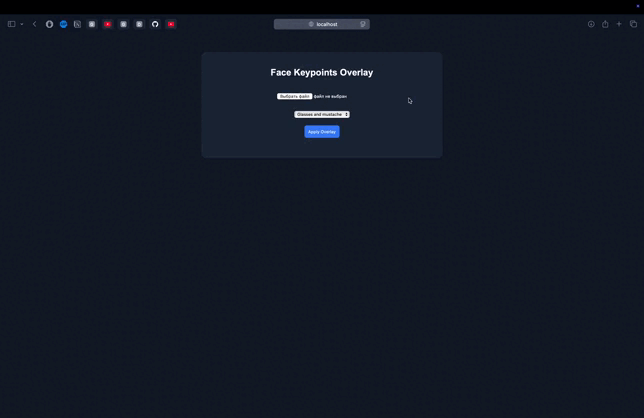
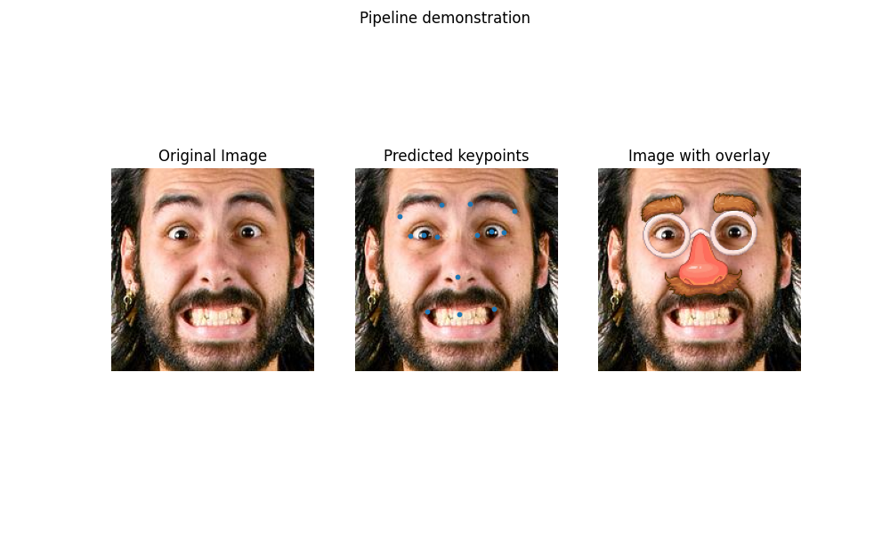

# face-keypoints-overlay

Deep learning pipeline for facial keypoint regression with a modular system for overlaying graphics on detected faces.

---

## Demo



Original pipeline visualization:



---

## Features

- Facial keypoint regression (CNN / ResNet-like models)
- Modular training pipeline with early stopping and mixed precision (AMP)
- Flexible configuration system (CLI + YAML + ENV)
- Callback-based inference pipeline
- Keypoint-driven overlay system for applying graphical masks
- Albumentations-based augmentation pipeline
- Clean CLI interface (train / inference / overlay)
- FastAPI-based backend service
- Simple browser UI
- Docker & docker-compose support

---

## Pipeline

The project is organized into three independent pipelines:

### Training

- Dataset loading and augmentation
- Model training with AMP
- Metric computation (MSE, MAE, NME)
- Early stopping and best model selection

### Inference

- Image preprocessing
- Keypoint prediction
- Optional visualization

### Overlay

- Keypoint-based transformations
- Mask application
- Result visualization

### Data flow

image -> preprocessing -> model -> keypoints -> overlay

---

## Installation

### Option 1 — Poetry (recommended for development)

```bash
git clone git@github.com:hyppocritt/face-keypoints-overlay.git
cd face-keypoints-overlay

poetry install
```

Activate environment:

```bash
poetry env activate
```

Run commands with:

```bash
poetry run <command>
```

---

### Option 2 — Docker

```bash
git clone git@github.com:hyppocritt/face-keypoints-overlay.git
cd face-keypoints-overlay
```

Build and run:

```bash
docker compose up --build
```

After startup open:

```
http://localhost:8000
```

---

## Usage

### Web UI (recommended)

Run with Docker:

```bash
docker compose up -d
```

Or locally:

```bash
poetry run uvicorn src.api:app --reload
```

Open in browser:

```
http://127.0.0.1:8000
```

Upload an image, choose a mask, and get the result.

---

### CLI

#### Training

```bash
poetry run python -m src train --data path/to/data
```

With overrides:

```bash
poetry run python -m src train \
    --data path/to/data \
    training.lr=0.01 \
    dataloader.batch_size=32
```

---

#### Inference

```bash
poetry run python -m src inference --data path/to/data
```

With overrides:

```bash
poetry run python -m src inference \
    --data path/to/data \
    inference.vis=first \
    detect.use_amp=true
```

---

#### Overlay

```bash
poetry run python -m src overlay --data path/to/data
```

With overrides:

```bash
poetry run python -m src overlay \
    --data path/to/data \
    overlay.mask=default \
    overlay.save=true
```

---

## API

### POST /overlay

- Accepts image file
- Returns processed image

Example (curl):

```
curl -X POST http://127.0.0.1:8000/overlay \
    -F "file=@image.jpg" \
    -F "mask=default" \
    --output result.png
```

---

## Configuration

The project uses a unified configuration system:

- CLI arguments
- YAML config files
- Environment variables
- Default values

Priority:

CLI > YAML > ENV > defaults

Example:

```bash
poetry run python -m src train --config configs/train.yaml
```

---

## Project structure

```
src/
  training.py
  inference.py
  overlay.py
  api.py
  cli.py
  detector.py
  dataset.py
  mask.py
  paths.py
  services/
  models/
  utils/
  ui/
```

---

## Metrics

- MSE (Mean Squared Error)
- MAE (Mean Absolute Error)
- NME (Normalized Mean Error)

---

## Future Improvements

- Face detection integration for real-world images
- Pretrained backbones (ResNet / MobileNet)
- Experiment tracking (TensorBoard / Weights & Biases)
- Batch API support
- Authentication for API

---

## Notes

- Torch is not included in Poetry dependencies for Docker optimization
- Install it manually for local training if needed
- UI is served via FastAPI and can be proxied with nginx
